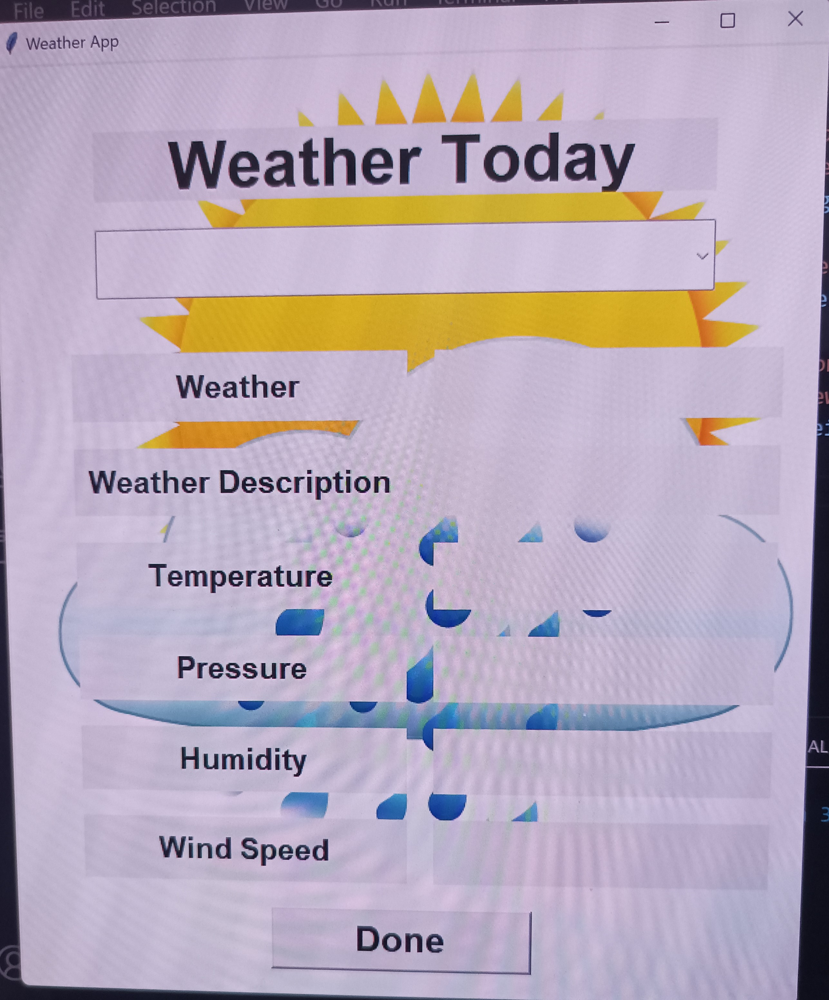
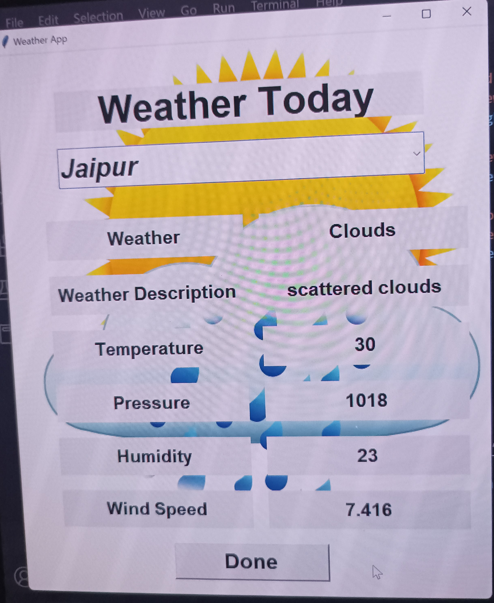
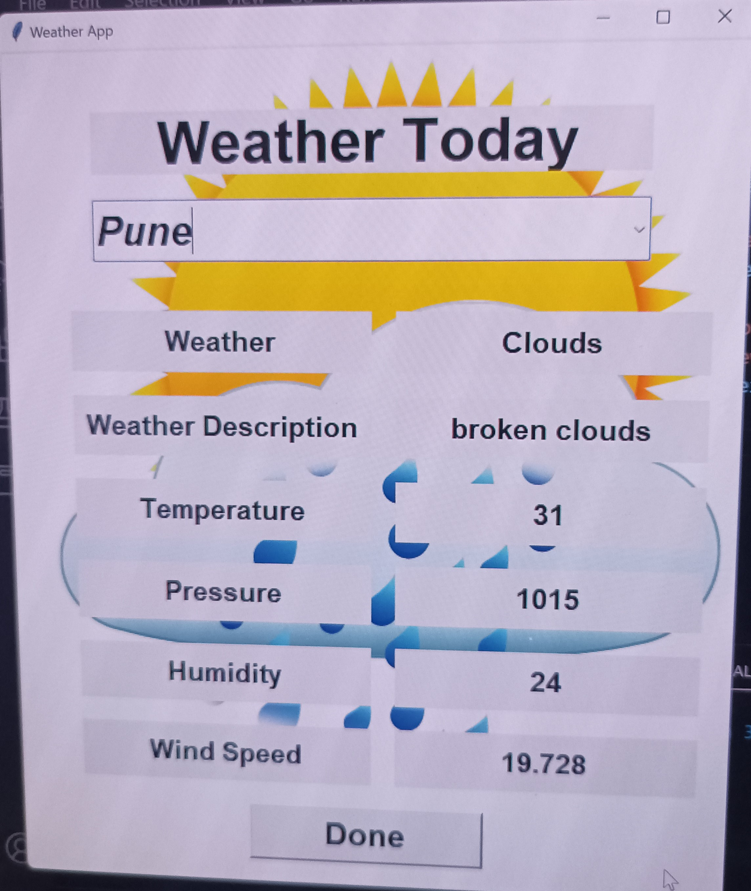
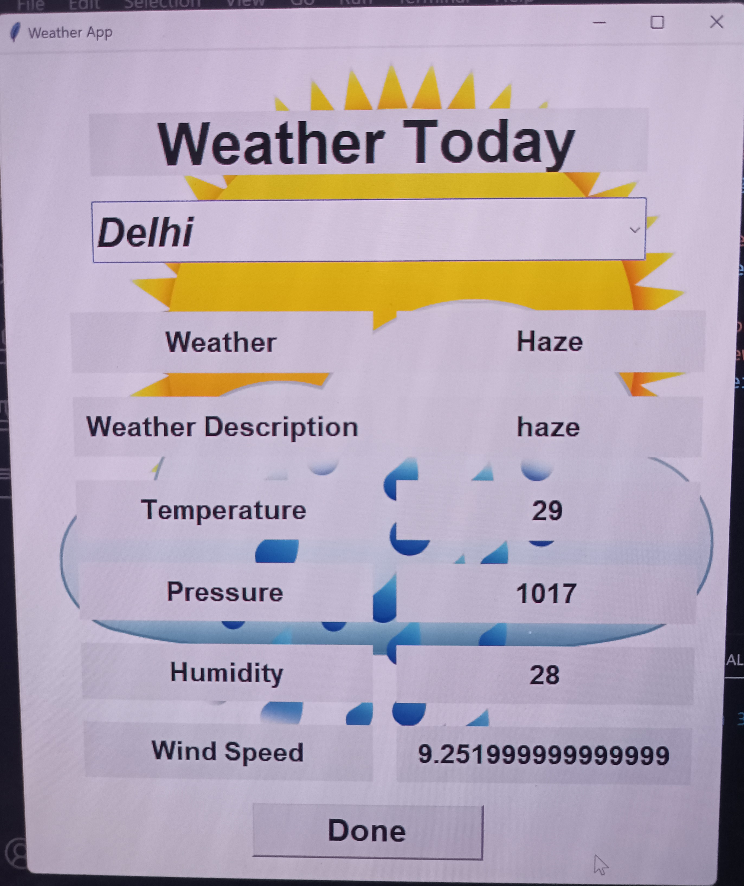

# Weather Application

## The Weather application using tkinter. The GUI app will provide information about Weather, Weather Description, Temperature, Pressure, Humidity, Wind speed of a particular city with their country

* Open Code Folder in Python IDEs

###### for exaple,Visual Studio Code, Sublime Text ,Atom etc.
* install Respective Python libraries
```
pip install tkinter
pip install requests
```
### Then You have generate Your Own API key
* Login in the [Open Weather Map](https://openweathermap.org/)
* Go to the API section. Then in the Current Weather Data section click on the API Document
* Now in the API Call section,You to link Your own api to code
```
requests.get("https://api.openweathermap.org/data/2.5/weather?q="+city+"&appid=your_api").json()
```
* Then run the Code

## Output!:







